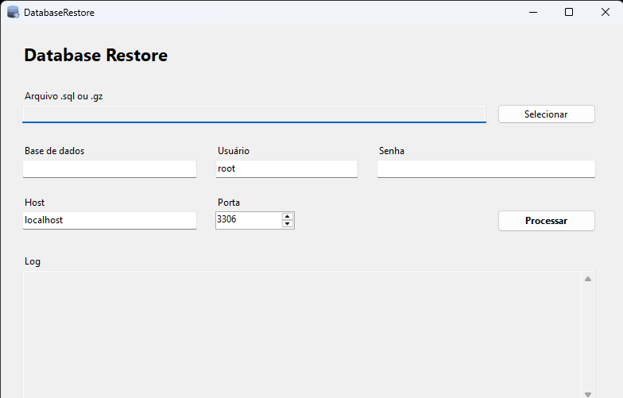

# DatabaseRestore

Aplicativo Windows em C# para restaurar arquivos `.sql` ou `.gz` em uma base MySQL usando uma instancia WSL.

## Tela do aplicativo



## O que o aplicativo faz

- Seleciona um arquivo local do Windows com extensao `.sql` ou `.gz`.
- Converte o caminho do Windows para o formato usado pelo WSL.
- Executa o restore no MySQL dentro do WSL.
- Mostra o resultado do processamento em uma area de log.

## Pre-requisitos

- Windows com WSL instalado e configurado.
- MySQL client instalado dentro do WSL.
- A base de dados MySQL ja criada.
- Acesso ao arquivo selecionado pelo WSL.

Exemplo de caminho convertido:

```text
E:\Projetos\DatabaseRestore\Databases\202605\dump.sql.gz
```

vira:

```text
/mnt/e/Projetos/DatabaseRestore/Databases/202605/dump.sql.gz
```

## Como usar

1. Abra a solucao `DatabaseRestore.slnx` no Visual Studio.
2. Execute o projeto `DatabaseRestore`.
3. Clique em `Selecionar` e escolha um arquivo `.sql` ou `.gz`.
4. Informe os dados da conexao MySQL:
   - Base de dados
   - Usuario
   - Senha
   - Host
   - Porta
5. Clique em `Processar`.
6. Acompanhe o resultado na area de log.

## Comandos executados

Para arquivos `.sql`, o aplicativo executa um comando equivalente a:

```bash
mysql --host='localhost' --port='3306' --user='root' --password='senha' 'nome_da_base' < '/mnt/e/caminho/arquivo.sql'
```

Para arquivos `.gz`, o aplicativo executa um comando equivalente a:

```bash
gzip -dc -- '/mnt/e/caminho/arquivo.sql.gz' | mysql --host='localhost' --port='3306' --user='root' --password='senha' 'nome_da_base'
```

## Observacoes

- Arquivos em unidades locais do Windows, como `C:` ou `E:`, sao convertidos para `/mnt/c` ou `/mnt/e`.
- Caminhos de rede UNC, como `\\servidor\pasta\arquivo.sql`, nao sao suportados nesta versao.
- A senha e passada para o comando `mysql` durante a execucao. Para uso em ambientes mais sensiveis, considere trocar por um arquivo de configuracao seguro do MySQL, como `~/.my.cnf`.

## Estrutura principal

- `DatabaseRestore.slnx`: solucao para abrir no Visual Studio.
- `DatabaseRestore.csproj`: configuracao do projeto C#.
- `Form1.cs`: logica de selecao, validacao, conversao de caminho e execucao do restore.
- `Form1.Designer.cs`: componentes visuais da tela.
